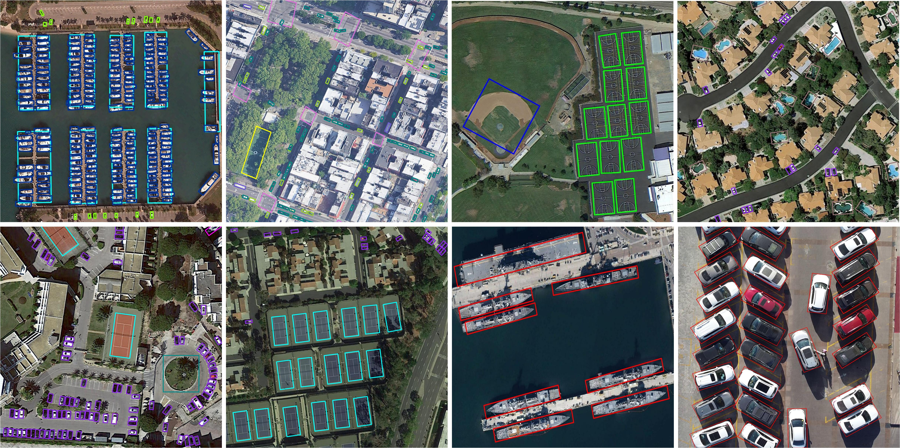

# TIOE-Det

This project hosts the official implementation for the paper: 

**Task Interleaving and Orientation Estimation for High-Precision Oriented Object Detection in Aerial Images** 
[[URL](https://www.sciencedirect.com/science/article/pii/S0924271623000011)][[PDF](https://ming71.github.io/Files/papers/TIOE.pdf)][[BibTex](https://ming71.github.io/Files/BibTeX/TIOEDet.html)]

( accepted by **ISPRS Journal of Photogrammetry and Remote Sensing**). 


## Abstract
 In this paper, we propose a  Task Interleaving and Orientation Estimation Detector for high-quality oriented object detection in aerial images. Specifically, a posterior hierarchical alignment (PHA) indicator is proposed to optimize the detection pipeline. TIOE-Det adopts PHA indicator to integrate fine-grained posterior localization guidance into classification task to address the misalignment between classification and localization subtasks. Then, a balanced alignment loss is developed to solve the imbalance localization loss contribution in PHA prediction. Moreover, we propose a progressive orientation estimation (POE) strategy to approximate the orientation of objects with n-ary codes. On this basis, an angular deviation weighting strategy is proposed to achieve accurate evaluation of angle deviation in POE strategy.

## Framework
 

### Setup
```
conda create -n tioe python=3.6 -y
source activate tioe
pip install torch==1.9.0+cu111 torchvision==0.10.0+cu111 torchaudio==0.9.0 -f https://download.pytorch.org/whl/torch_stable.html

sudo apt-get install swig
pip install -r requirements.txt

cd  DOTA_devkit
swig -c++ -python polyiou.i
python setup.py build_ext --inplace
cd ..

sh compile.sh
```


### Training
  * Creat config files.
  * Dataset transformation via running `sh prepare.sh`.
  * Run `sh train.sh`.


### Inference & Testing
* Run `sh demo.sh` and `sh test.sh`.

## Visualizations
 


## Citation

If you find our work or code useful in your research, please consider citing:

```
@article{MING2023241,
title={Task interleaving and orientation estimation for high-precision oriented object detection in aerial images},
author={Qi Ming and Lingjuan Miao and Zhiqiang Zhou and Junjie Song and Yunpeng Dong and Xue Yang},
journal={ISPRS Journal of Photogrammetry and Remote Sensing},
volume={196},
pages={241-255},
year={2023},
issn = {0924-2716},
doi = {https://doi.org/10.1016/j.isprsjprs.2023.01.001},
}
```


Feel free to contact [me](chaser.ming@gmail.com)  if there are any questions.

